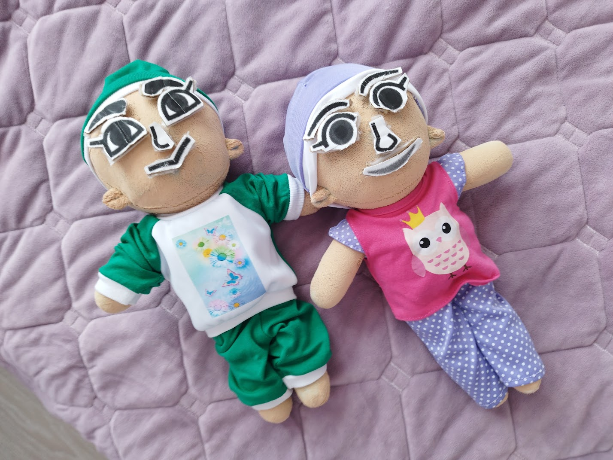
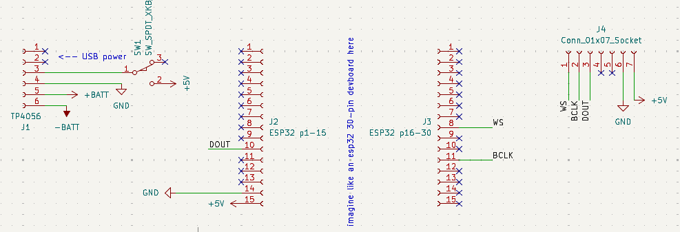
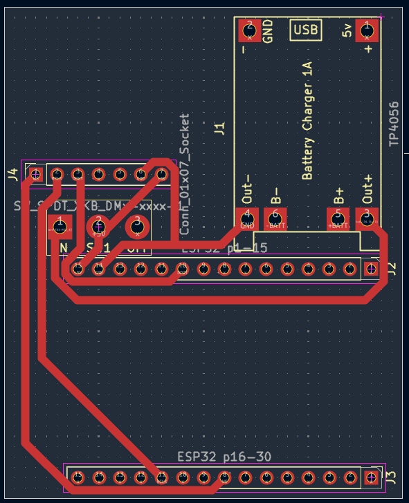

# yii
tomodachi life-style mii dolls with esp32's inside that can speak to each other via BLE and TTS!

## how do i use it?
first, you need to build the dolls!! you can find the pcb files and the schematic under the `kicad/` directory, or you can take a look at them here:

note that even though i'd recommend a pcb, it's not really necessary to use a pcb since all the components are held together by plush anyway. you can also see a list of components in `bom.csv`.\
as for the dolls themselves, go creative! i found [these on aliexpress](https://www.aliexpress.us/item/3256811798258951.html), and dyed them with fabric paint. i also glued on velcro with fabric glue for attaching the facial features (`face/` for files to be printed), and used a zip locker so that i can open and close them to take components out when needed.

after you're done with the physical part, install the firmware on your esp32's (can be found in `firmware/`)
you can use the [online tool](https://milk-cool.github.io/yii/) to set up the dolls' name and wifi password via usb, then connect via wifi, set voice parameters and reboot to doll mode! (note: if anything goes wrong and the dolls end up bricked, you can erase the flash with esptool, google it)

as for the remote, you're gonna need a plain esp32 board. just flash it with the same firmware and set it up like you'd set up a doll, but reboot it to control mode instead. then, using the online tool, you can control your dolls (poke, feed, and play with them).

## what does it do?
there's a lot of stuff you can do with the dolls, but the most important one is watching them!! if you get two or more of them, you can watch them talk to each other. they'll develop a friendship and maybe even a romantic relationship eventually! (note: there's no gender/romantic preferences system here, everyone's attracted to everyone)

other than that, you can feed them with the remote, poke them, or play games with them. you can also track their progress and their XP as they talk to others more and more.

## why does this exist?
i was a really big fan of tomodachi life ever since i learned about the first game, and i thought i might want to bring the concept of miis to life!! and so i did :D

it's nowhere near as good, obviously, but i'm happy with the result

## credits
1p2t kicad library: https://github.com/BrianLeishman/jrgbwww24/blob/master/1P2T%20SPDT.kicad_mod
tp4056 kicad library: https://github.com/ccadic/TP4056-18650